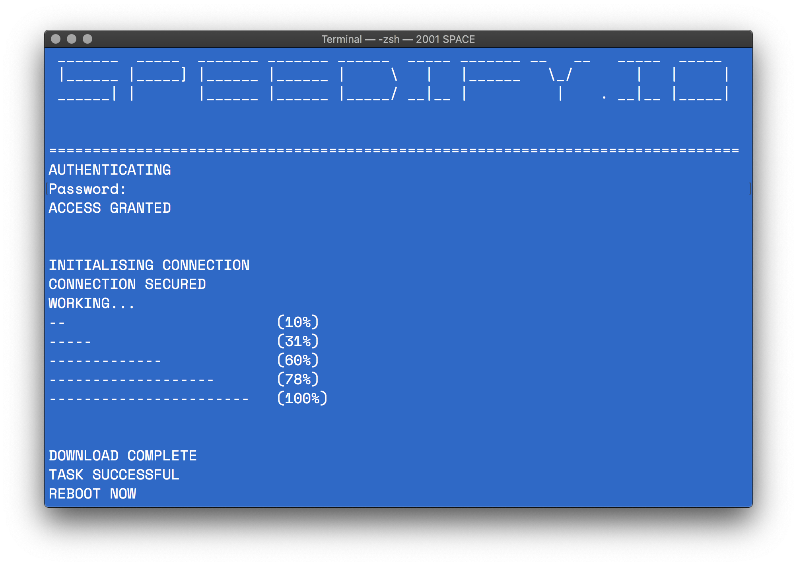

#  Speedify TCP optimiser

## Introduction

This script will output a configuration file for macOS and other BSD-like systems (sysctl.conf) with modified kernel and TCP stack settings designed to optimise network throughput and minimise latency. These settings will be applied at boot. The modified paremeters are intended for a client device on a home network over either ethernet or WiFi 802.11n/ac with a download speed of 50mbps-100mbps from your ISP. If you have a slower connection (DSL, dialup) using this script is not advised as the modification may be detrimental.

*Tested up to macOS 12.0 Monterey | File revision 1.2 | 06/17/2021*

## Usage

Manually run the configuration script from the command line:

```bash
sh -c "$(curl -fsSL https://raw.githubusercontent.com/raumfahrerspiffy/speedify.io/master/sysctl.sh)"
```


## *Note:*
This script will overwrite any previous configuration using sysctl.conf, please make sure to backup your configuration. If you are unsure if you have an existing configuration run this script:

```bash
cp /etc/sysctl.conf ~/desktop/CurrentConfig.txt
```
This will output a text file with your current config to your desktop, please check the file for applied parameters. If you receive an error "No such file or directory", then you're safe, you have no custom parameters.

## Troubleshooting
If you experiance noticable issues after running the configuration script, please run the following to remove the modified file:

```bash
sudo unlink /etc/sysctl.conf
```

Then reboot.
##
I welcome any issue reports and will do my best to address problems as they arise.
